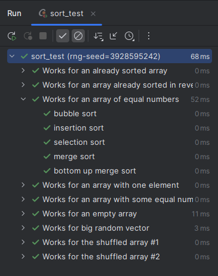
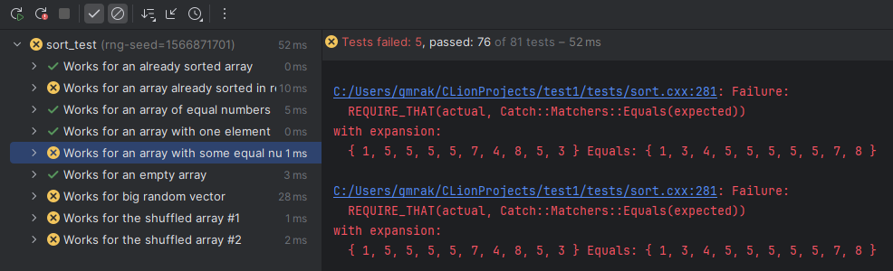
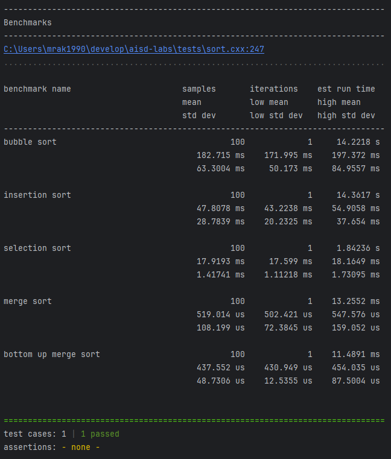

## Лабораторная работа #1
Для примера в репозитории уже реализована сортировка пузырьком (самая тривиальная реализация без каких-либо оптимизаций).
В заголовочном файле `headers/sort.h` содержатся декларации всех функций, которые встречаются в задачах.
Для сдачи лабораторной работы часть из них вам не потребуется (в зависимости от того, какие из задач вы решите сделать).
Реализации функций находятся в файле `src/sort.c`. Тела всех функций кроме `bubble_sort(...)` пустые.
Это необходимо для успешной компиляции тестов, которые находятся в файле `tests/sort.cxx`.
Помимо тестов этот файл содержит также 1 бенчмарк для сравнения скорости работы разных алгоритмов сортировки на случайном массиве длиной `10 000` чисел.
Для запуска в репозитории имеются 3 таргета:
1. `tests/sort` — запуск всех тестов (кроме бенчмарка), вывод интегрирован в интерфейс `CLion`.
Для удобства работы с тестами из файла `tests/sort.cxx` стоит удалить, либо закомментировать вызовы всех методов которые вы не будете реализовывать.
По необходимости можно добавить новые тесты, если есть необходимость. тесты можно добавить как в существующий файл, так и в любой файл имеющий путь `tests/sort*.cxx` (например, `tests/sort_1.cxx`) .




2. `benchmarks/sort` — запуск бенчмарка для сравнения скорости работы алгоритмов сортировки.
По необходимости можно добавить новые бенчмарки.
Например, бенчмарк в котором запускается один метод сортировки для массивов разной длины, что позволит изучить эмпирически временную сложность реализованного алгоритма)



3. `playground` — запуск функции `main`, определённой в файле `src/main.c`.
Необходим для запуска различных кусков кода если возникнет такая необходимость.
Сейчас он уже содержит пример кода с вызовом пузырьковой сортировки.

Для тестов и бенчмарков используется библиотека [`Catch2`](https://github.com/catchorg/Catch2) (на данный момент `v3.7.0`).
Документация с примерами и возможностями может быть найдена [тут](https://github.com/catchorg/Catch2/blob/devel/docs/Readme.md).

### Обязательные задачи
1. Реализовать сортировку вставками в методе `insertion_sort(...)`

2. Реализовать сортировку выбором в методе `selection_sort(...)`

3. Реализовать рекурсивный вариант сортировки слиянием в методе `merge_sort(...)`.
Для реализации понадобится вспомогательная функция `merge_sort_recursive` (вызывающая сама себя рекурсивно) и функция `merge` для слияния двух отсортированных подмассивов, идущих друг за другом.
```
merge_sort_recursive(arr, l, r):
	if r - l <= 1:
		return
	m = (l + r) / 2
	merge_sort_recursive(arr, l, m)
	merge_sort_recursive(arr, m, r)
	merge(arr, l, m, r)
```

4. Реализовать нерекурсивный вариант сортировки слиянием (`bottom-up merge sort`) в методе `merge_bottom_up_sort(...)`.
Алгоритм основан на том, что классический рекурсивный алгоритм может быть исполнен в обратном порядке.
На первом шаге считаем что наш массив состоит из отсортированных подмассивов длины 1.
Эти массивы попарно могут быть слиты функцией `merge`.
После этого наш массив состоит из отсортированных подмассивов длины 2, для которых можно вызвать процедуру `merge` ещё раз и получить массив, состоящий из отсортированных подмассивов длины 4.
Процедура повторяется до тех пока, пока не будут слиты два последних отсортированных подмассива.

5. Реализовать сортировку Шелла (функция `shell_sort`).
Для выбора шага использовать последовательность, предложенную Праттом: $2^i\cdot3^j \le n/2, i, j \in \mathbb N$ ($n$ — длина массива).

### Решить одну задачу из двух на выбор
#### Эмуляция стека
Необходимо реализовать рекурсивный вариант сортировки (функция `merge_sort_emulated_recursion`) слиянием без использования рекурсивных вызовов на уровне языка.
Для этого необходимо использовать стек, в который будут помещаться «метод» и аргументы для вызова этого метода.
В случае сортировки слиянием имеем две операции (`SORT` и `MERGE`) и границы подмассивов.
Для реализации стека на языке C можно объявить следующее перечисление и структуру:
```
enum merge_sort_op { SORT, MERGE };
struct merge_sort_stack_frame {  
    int l;
    int m; // used only for op MERGE
    int r;
    enum merge_sort_op op;
};
```
Схема замены стека языка C (либо любого другого стекового языка программирования) программным стеком заключается в замене вызовов функций на вызов функций `push`/`pop` у стека.
Первым шагом необходимо инициализировать стек операцией `SORT` для всего массива.
Далее необходимо брать из стека очередную операцию, пока стек не станет пустым.
```
merge_sort_emulated_recursion(arr, 0, n):
	stack = []
	stack.push((0, -1, n, SORT))
	while !stack.empty():
		(l, m, r, op) = stack.pop()
		if op = SORT:
			if r - l <= 1:
				continue
			m = (l + r) / 2
			stack.push((l, m, r, MERGE))
			stack.push((l, -1, m, SORT))
			stack.push((m, -1, r, SORT))
		if op = MERGE:
			merge(arr, l, m, r)
```
Для реализации стека можно использовать массив из объявленных выше структур (метод [`malloc`](https://en.cppreference.com/w/c/memory/malloc)), который будет увеличиваться в размерах при необходимости (метод [`realloc`](https://en.cppreference.com/w/c/memory/realloc)).
В качестве альтернативы можно реализовать стек используя связный список.

#### Оптимизированная сортировка вставками (функция `insertion_sort_optimized`)
Каждый шаг сортировки вставками заключается в сравнении соседних элементов массива и их перестановке в случае необходимости.
Число сравнений на каждом шаге можно снизить до $\mathcal{O}(\log{k})$ (где $k$ — длина отсортированного префикса) если использовать бинарный поиск для поиска позиции куда вставить очередной элемент в отсортированный префикс массива.
При этом вместо последовательных перестановок соседних элементов массива возникает необходимость перемещения подмассива вправо на одну позицию (можно использовать функцию [`memcpy`](https://en.cppreference.com/w/c/string/byte/memcpy)) вместо перестановки отдельных элементов массива.
```
insertion_sort_optimized(arr):
	for i = 1 .. n - 1:
		to_insert = arr[i]
		j = bin_search(arr, to_insert, 0, i - 1)
		arr[j + 1 .. i] = arr[j .. i - 1]
		arr[j] = to_insert
```